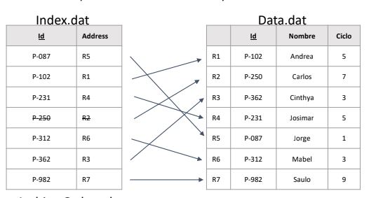
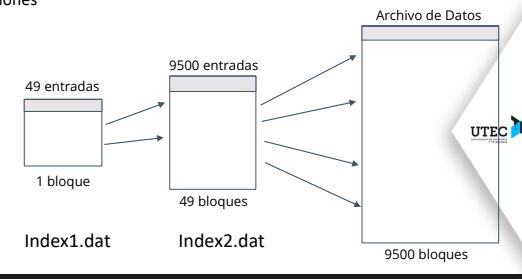

# Informe

## Introducción

El hash extendible y el indexed sequential access method ISAM son técnicas 
de indexación muy conocidas y mediante las muestras de  tiempo vamos a poder notar la diferencia entre ambas.

>ISAM

El ISAM combina las grandes facultades de los métodos de acceso secuencial y random. Usualmente se implementa usando un Index File y un Data File. 

El Index File está compuesto de 2 columnas, la primera es la llave a la que 
se aplica el método de indexación, y la otra es la dirección o posición donde se encuentra el registra con la llave correspondiente. Además, existen 
2 tipos de index file dentro de los ISAM, estos son los dense y los sparse.
La diferencia más notoria es la de la poca cantidad de entradas en el Sparse Index File, debido a que cada entrada del Index File va a apuntar a un grupo de registros en el Data File, cuyos registros en el Data File tienen que estar ordenados según su llave. Por otro, lado em el Dense Index File, cada registro en el Data File tiene su respectivo mapeo en el Dense Index File, por lo que el dense index file tiende a tener más filas o tuplas. Sin embargo, la búsqueda de un registro es más lento en un dense index file.

Por otra parte, el Data File va a contener los datos con los registros, la cantidad de datos en cada columna puedes ser variante por lo que el tamaño 
de cada registro también puede cambiar. 

Así como se puede tener un index file con un data file, se puede incluso mapear llaves con otro index file, con el fin de aligerar la búsqueda de un registro o los registros cuyos valores de llave están dentro de un rango. A este concepto se la llama multilevel index_file;

https://www.kaggle.com/jessemostipak/hotel-booking-demand
https://www.kaggle.com/smithsonian/volcanic-eruptions

## Técnicas

- Hash extendible.
- B+ tree.

## Benchmark

### INSERT

`COPY volcano FROM "database.csv" CSV HEADER;`
|Índice    |Lecturas|Escrituras|Tiempo    |
|----------|--------|----------|----------|
|Sin índice|69      |71        |20.337    |
|Hash      |14800   |8569      |48.059    |

`COPY hotel FROM "hotel_bookings.csv" CSV HEADER;`
|Índice    |Lecturas|Escrituras|Tiempo    |
|----------|--------|----------|----------|
|Sin índice|4121    |3396      |646.712   |
|Hash      |88032810|261432    |112510.605|

### SELECT
El promedio de 100 SELECTs.

`SELECT * FROM volcano WHERE Country IS "Peru";`
|Índice         |Lecturas|Escrituras|Tiempo   |
|---------------|--------|----------|---------|
|Sin índice     |3402    |1.07      |201.36222|
|Hash extendible|795     |1.07      |2.01123  |

`SELECT * FROM hotel WHERE country IS "PER";`
|Índice         |Lecturas|Escrituras|Tiempo   |
|---------------|--------|----------|---------|
|Sin índice     |76      |0.69      |1.76824  |
|Hash extendible|24      |0.69      |0.18064  |

## Uso y video
`proyecto-1` soporta los siguientes comandos SQL.
- `CREATE TABLE table_name (name type, ...);`
- `CREATE INDEX ON table_name(column_name);`
- `CREATE INDEX ON table_name USING hash(column_name);`
- `SELECT * FROM table_name;`
- `SELECT * FROM table_name WHERE column IS value;`
- `SELECT * FROM table_name WHERE column BETWEEN value AND value;`
- `INSERT INTO table_name VALUES (value,...), ...;`
- `DELETE FROM table_name WHERE column IS value;`
- `DELETE FROM table_name WHERE column BETWEEN value AND value;`
- `COPY table_name FROM file.csv CSV HEADER;`
